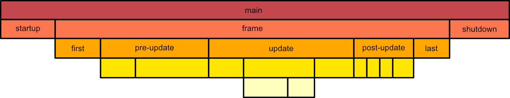

# Feature Name: `stages_are_labels`

##  Summary

Reincarnates stages as hierarchical labels and splits run criteria into conditions and transitions; solution for the problems collated in [#2801][1]. 

## Motivation

System scheduling is one of the most important pillars of the ECS architectural pattern. Being fully on the data-oriented side of things, it's more often than not a brand new concept to people who are more used to object-oriented programming.

From the design goals summarized in [#2801][11], it's clear that a good system scheduling API is foremost easy to understand. The best tools are ones everyone can use after all. Everything Bevy exposes should have a clear, unique, and useful purpose. 

What Bevy has today is already very impressive in that regard. The current system scheduling API packs great functional coverage into a tasteful number of types (less *is* more), but their cohesion leaves a little to be desired, so the API is due for some cleaning.

Several scheduling rework ideas aim to improve concurrency by *extending* the API with more granular language. This proposal instead focuses on *reducing and reorganizing* what is already there. With relatively minor tweaking, we should be able to reduce overlap, improve compatibility, and increase functionality.

## User-facing explanation

Before describing how the API should change, what does it look like right now?

### Commands

Commands are structural changes to the world. These include spawning or despawning entities and inserting or removing their components. These actions are noteworthy because they indirectly affect components with table storage.

### Systems

Systems are functions that can read and write data stored in the world. They come in two types—**concurrent** and **exclusive**.

**Concurrent** systems are scheduled by the executor according to what data they access, the nature of that access, and any user-given ordering constraints. Concurrent systems with non-conflicting data access can be executed in parallel. For example, a concurrent system that only reads `Transform` components cannot execute at the same time as another concurrent system that can write them. Concurrent systems may produce commands, but the actual application of those commands must be deferred.

**Exclusive** systems mutably borrow the entire world, so by definition they cannot execute in parallel with other systems. Only exclusive systems have the ability to apply structural changes (e.g. deferred commands) to the world.

### System Labels

Systems are labeled so that users can order them with `.before(Label)` and `.after(Label)` modifiers. Each system can have many labels and each label can be added to many systems.

### (System) Sets

System sets are a tool for applying the same constraints to multiple systems. Their purpose is to cut down on boilerplate.

### Stages

Stages represent **atomic** blocks of systems. Assigning systems to a stage informs the executor that, as a group, those systems should be preceded and followed by an exclusive system that applies any pending commands to the world. By virtue of sitting between these "sync points," systems inside a stage are completely isolated from systems outside of it.

### Why are people so eager to remove stages?

Stages make it impossible for certain systems to run concurrently. In a sense, stages *take away* concurrency, and they seem bad when cast under that light. However, stages are almost always a conscious design decision. Concurrency must be sacrificed to apply pending commands.

That said, plugins—for lack of better means—often export stages even when their included systems don't produce any commands, sacrificing concurrency unnecessarily. The plugin ecosystem is beyond the scope of this RFC, but it's worth mentioning since it's probably the main motivation for replacing stages. Unfortunately, naming the design exploration "stageless" has caused many people to mistakenly believe that *having stages* is a problem.

Many of the other problems highlighted in [#2801][1] can indeed be traced back to their current *implementation*, though.

Here are the root problems with stages:

1. The `SystemStage` type is [a very large monolithic thing][2] that owns its systems and has its own executor.
2. They can't be nested.

These properties keep stages from reaching their full potential. For example, because `SystemStage` instances cannot be nested, if users want to implement a common flow control pattern, like making a frame-independent loop, they have to do something awkward like this.

```rust
fn main() {
    App::new()
        /* ... */
        .with_stage("frame-independent loop", 
            Schedule::default()
                .with_stage(/* ... */)
                /* ... */
        ).with_run_criteria(FixedTimestep::steps_per_second(60))
        /* ... */    
    .run();  
}
```

### RunCriteria

Run criteria are special systems that users can attach to systems and stages to control when they run. The executor evaluates system run criteria at the beginning of each stage and then orders the systems whose criteria have been met. 

There's more to them, though. Run criteria are also responsible for making stages loop and transitioning between states. This extra responsibility makes combining run criteria rather messy since, instead of booleans, run criteria return a [`ShouldRun`][3] enum.

```rust
#[derive(Debug, Clone, Copy, PartialEq, Eq)]
pub enum ShouldRun {
    Yes,
    No,
    YesAndCheckAgain,
    NoAndCheckAgain,
}
```

An unfortunate side effect of the current implementation is that `SystemStage` loops will "lose" to `State` transitions whenever they conflict.

## Proposed Changes

### One Executor

One major, recurring idea in scheduling rework discussions is having one executor for the entire schedule. This lone executor would simplify internal code and give apps maximum flexibility to order systems concurrently (since it knows about all systems). Implementing this is basically just renaming `SystemStage` to `Schedule`.

### Hierarchical Stage Labels

The lone executor in place, stages can just be special labels that tell the executor that some systems are in a group, that it doesn't need to look in other groups when ordering them, and to flush any commands after they run.

```rust
.add_system(my_startup_system.to_stage(CoreStage::Startup))
```

We can go a step further and arrange these labels in a tree. These hierarchical stages can replace nested schedules for building complex control flows. Unlike nested schedules, stages can be ordered independently of adding systems.


(All blocks pictured are stages.)

```rust
pub struct Schedule {
    /* ... */
    trees: HashMap<TreeLabel, Tree<StageLabel>>,
    /* ... */
}

impl Schedule {
    pub fn minimal() -> Self {
        Self::default()
            .add_stage(CoreStage::Startup)
            .add_stage(CoreStage::Frame.with_transitions(loop_until_shutdown))
            .add_stage(CoreStage::Shutdown)
    }

    pub fn standard() -> Self {
        Self::minimal()
            .add_stage(CoreStage::First.append_to(CoreStage::Frame))
            .add_stage(CoreStage::PreUpdate.append_to(CoreStage::Frame))
            .add_stage(CoreStage::Update.append_to(CoreStage::Frame))
            .add_stage(CoreStage::PostUpdate.append_to(CoreStage::Frame))
            .add_stage(CoreStage::Last.append_to(CoreStage::Frame))
    }
}
```

### RunCriteria are split into Transitions and Conditions

### Transitions and "the stack"

Run-time execution of a schedule uses a stack model, where the executor pops the next stage to run from the top of the stack. The stack makes it easy to "connect" separate stage hierarchies together. Stages in each hierarchy are run in post-order (left to right, children before parents). Users can modify the stack using `push`, `set`, and `replace` operations. By convention, this is only allowed at the end of a stage, when there are no pending commands. These stack operations supersede `SystemStage` loops and `State` transitions, putting them both on the same level.

```rust
pub struct StackFrame {
    platform_state: PlatformState
    app_state: AppState,
    tree: TreeLabel,
    stage: StageLabel,
    pending: bool,
}

pub struct Executor {
    /* ... */
    current: StackFrame,
    stack: Vec<StackFrame>,
    /* ... */
}
```

(TODO: add more diagrams)

To let concurrent systems queue changes, this rework introduces **transitions** as the "commands" for modifying the stack. Unlike commands, users must attach their own transition-handling systems to stages in order to use them. Transitions have very few constraints, so users should be encouraged to use them [sparingly][7].

```rust
pub enum AppState {
    Loading,
    InGame,
    Paused,
}

fn my_transition_handling_system(
    mut transitions: Transitions, // Not sure what fields this type should have.
    mut stack: ResMut<Stack>,
    curent_frame: Res<StackFrame>,
) {
    let mut next_state = stack.peek();

    for transition in transitions {
        if /* ... */ {
            stack.set(next_state.set_app_state(AppState::Paused));
        } else if /* ... */ {
            stack.replace(/* ... */)
        }
    }
}

.add_stage(MyStages::ExampleStage
    .with_transitions(my_transition_handling_system)))
```

With this rework, states can just be plain enums. "States" as we currently know them would be a higher-level abstraction that couples these enums and stages in a limited number of interesting ways (`on_enter`, `on_exit`, `on_update`, etc.).

### Conditions

With their noodly transition responsibilities removed, run criteria become simple boolean **conditions** that can be combined in intuitive ways using `and`, `or`, `xor` and `not` modifiers. Conditions can be attached to systems, stages, and complete schedules.

```rust
fn client_is_connected(
    role: Res<NetRole>, 
    session: Res<NetSession>) -> bool
{
    role.is_client() && session.is_connected()
}

.add_system(load_game
    .with_condition(client_is_connected))
```

Stage conditions are evaluated when the stage is popped from the stack. System conditions are re-evaluated every time their stage is executed.

```
while stack is not empty
    pop stage from stack

    if stage is pending 
        // Condition must have been true and all children must have completed.
        run systems in stage

    else if stage condition == true
        if stage is leaf 
            run systems in stage
        else
            mark stage as pending
            push stage back onto stack
            push children onto stack in reverse order
```

### SystemSet is renamed to Config

While we're bikeshedding, there's no overlap between stages and system sets, but "set" and "added to a set" sort of imply that the systems have some ordering relationship. "Config" seems clearer.

### So what does all this accomplish?

Clearer separation of responsibilities, better cohesion, more utility, and better code reuse.

- With stages being labels, users can:
  - Choose not to use them. The schedule has a default.
  - Apply them with configs (system sets).
  - Assemble them in a hierarchy independently of adding systems.
  - Export them in a plugin so end users can incorporate them into their schedule as "pre-packaged" logic (pending plugin rework).
  - Add ones they've imported from plugins as children or siblings of their own and vice-versa.
  - Add them as children or siblings *more than once*.
- Condition systems can be read-only and can be combined through regular boolean operations.
- Transitions no longer have implicit conflicts.
- States and stages are decoupled (although a higher-level API may re-introduce coupling).

## Implementation Strategy

(TODO)

- Remove exclusive system modifiers (`at_start`, `before_commands`, `at_end`) in favor of ordering them the same way as other systems.
- Remove `startup` system modifier. Systems can be added directly to `CoreStage::Startup`.
- Rebrand `RunCriteria` into `Condition`, change them to be pure booleans, then add composition methods (`and`, `or`, `xor`, `not`).
- Rebrand `SystemStage` into `Schedule` and modify it to hold stage trees.
- Fully commit to the [builder API for systems][12] so that everything feels consistent.
- For convenience, add an API shortcut for adding an exclusive system that just applies commands (i.e. `flush_commands`).
- Make it so that when a user appends/prepends a sub-stage to a stage that already has systems, those systems are re-labeled with an anonymous sub-stage.
- (TODO) Explain how the executor can build the system graph(s) and find all the systems that are supposed to run in each stage.
- (TODO) What's in the `Transition` type?
- (TODO) Systems should have limits on which stages they can queue transitions for (i.e. only the current stage or its immediate parent).
- (TODO) Transitions should be marked with their "terminal" stage and discarded once that stage completes, as a safeguard.

```rust
// Add to default stage tree
.add_stage(StageLabel)
.add_stage(StageLabel.prepend_to(StageLabel))
.add_stage(StageLabel.append_to(StageLabel))
.add_stage(StageLabel.insert_before(StageLabel))
.add_stage(StageLabel.insert_after(StageLabel))
.add_stage(StageLabel
    .with_condition(System)
    .with_transitions(System))

// Add new stage tree
.add_tree(TreeLabel
    .add_stage(StageLabel
        .with_condition(System)
        .with_transitions(System)))

.add_system(System.to_stage(StageLabel))

// Setup a group of modifiers in advance to add to systems later
.add_config(Config
    .label(SystemLabel)
    .to_stage(StageLabel)
    .after(SystemLabel)
    .with_condition(System.and(System.not())))

.add_system(System
    .label(SystemLabel)
    .with_config(Config))

// conditions
.and(System)
.or(System)
.xor(System)
.not()
```

## Drawbacks

- TBD

## Rationale and alternatives

### Why can't stages run in parallel?

First, it really only makes sense to ask this question about stages imported from plugins. Users can always add their own systems to the same stage. 

Now, to answer the question:

- Commands require exclusive mutable world access, so sync points can only exist in series.
- Transitions, by convention, can't happen in parallel either since the executor can only be in one state at a time.
- Bevy respects plugin privacy rules and does not allow users to freely dissect imported stages.

Hypothetically, if Bevy knew that some commands would never affect certain archetypes, it could scope the world access appropriately and run other systems in parallel. However, that would require (1) a much more verbose API for specifying exact system side effects and relationships and (2) hard-coding many more special cases into the schedule builder. 

Forcing this level of explicitness on the general user would be bad. 

Still, for the sake of argument, if we had such an API available to complement this one, maximizing concurrency would require dissolving plugin stages and adding new constraints to their systems to deal with the resulting ambiguities, which are both things that plugin privacy rules specifically prevent.

So ultimately, the only way to accommodate everyone is for plugin authors to:
- Prefer exporting system labels for groups of systems that do not queue commands or transitions.
- Even when stage labels *are* the right export, also export system labels to give advanced users more flexibility.
- Either provide a means to [reconfigure labeled systems][4] or just export the system functions directly.

(For some context,  `@cart` [is against *requiring* plugins to make everything public][5].)

### Isn't it better to avoid sync points?

This is really a question for the end user.

Sync points are neither good nor bad. They have to exist whenever you want to apply commands. Reducing the number of sync points in a schedule requires deliberate decisions to redesign logic to defer commands or accept stale reads, and Bevy can't make those decisions for you.

Optimal scheduling is an NP-complete problem. It's okay to not have a perfect schedule.

## Unresolved questions

- Does it make sense to apply these constraints to transitions at the low-level?
- Should app/lifecycle states be included in the execution stack or left out of it?
  - Excluded, states are just global pattern matching values.  
  - Included, states gain the reentrancy/nesting powers of a stack for free, but lose the ability to change outside of transitions (states would be read-only while a stage is being executed).

## Future Possibilities

- Having a single executor and reducing stages to labels should make it easier to [rebuild the schedule at runtime][8].

- The proposed changes should be compatible with the plugin configuration machinery described in [RFC #33][4]. In fact, stages being labels should make it easier for plugins to transparently share "pre-packaged" functionality. Plugins could simply check which of their stages have been inserted, then add the appropriate systems and stage trees.

    ```rust
    impl Plugin for MyPlugin {
        fn build(state: &mut PluginState) {
            for label in my_plugin_crate_labels {
                if state.labels().contains(&label) {
                    // add (sub) stages, and systems
                    // insert and initialize resources
                    // build other dependencies
                    /* ... */
                }
            }
        }
    }
    ```

- If a user is willing to forgo commands and accept stale reads for some calculation, they can spawn a task, copy the required data into it (eliminating race conditions), run it asynchronously in the background, then poll or block on its completion later. Perhaps Bevy could highlight the task API for this (or come up with a higher-level abstraction if it would help). Unity's [Job System][6] is a good example. The new pipelined renderer operates on a similar principle by having a separate world.

[1]: https://github.com/bevyengine/bevy/discussions/2801
[2]: https://github.com/bevyengine/bevy/blob/997eae61854b362c10810884966ac605121e04d7/crates/bevy_ecs/src/schedule/stage.rs#L53
[3]: https://github.com/bevyengine/bevy/blob/5ba2b9adcf5e686273cf024acf1ad8ddfb4f8e18/crates/bevy_ecs/src/schedule/run_criteria.rs#L32
[4]: https://github.com/bevyengine/rfcs/pull/33
[5]: https://github.com/bevyengine/rfcs/pull/33#discussion_r709665190
[6]: https://docs.unity3d.com/Manual/JobSystemSafetySystem.html
[7]: https://statecharts.dev/state-machine-state-explosion.html
[8]: https://github.com/bevyengine/bevy/pull/2507
[9]: https://bevyengine.org/news/bevy-0-5/#states-v2
[10]: https://github.com/bevyengine/bevy/discussions/2801#discussioncomment-1303893
[11]: https://github.com/bevyengine/bevy/discussions/2801#discussioncomment-1330048
[12]: https://github.com/bevyengine/bevy/pull/2736