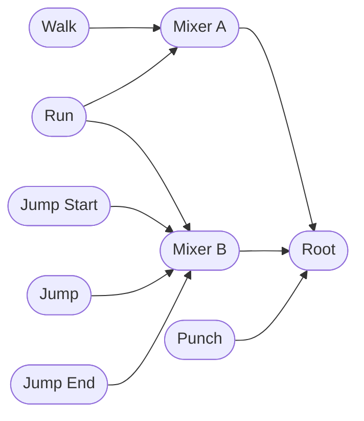

# Feature Name: `animation-composition`

## Summary
Animation is particularly complex, with many stateful and intersecting
elements. This RFC aims to detail a methodlogy for composing multiple animations
together in a generic and composable way.

## Motivation
Animation is at the heart of modern game development. A game engine without an
animation system is generally not considered production-ready. To provide Bevy
users a complete animation suite, simply start, stop, and seek operations on
singular clips of animation is not sufficient to cover all of the animation
driven use cases in modern video games. An animation system should be able to
support composing individual animations in a generic and flexible way. This would
enable artists, animators, and game designers to create increasingly dynamic
animations without needing to resort to reauthoring multiple variants of the same
animation by hand.

## Scope
Animation is a huge area that spans multiple problem domains:

 1. **Storage**: this generally covers on-disk storage in the form of assets as
    well as the in-memory representation of static animation data.
 2. **Sampling**: this is how we sample the animation assets over time and
    transform it into what is applied to the animated entities.
 3. **Application**: this is how we applied the sampled values to animated
    entities.
 4. **Composition**: this is how we compose simple clips to make more complex
    animated behaviors.
 4. **Authoring**: this is how we create the animation assets used by the engine.

This RFC only aims to resolve problems within the domain of composition and
application. Storage and sampling is addressed in [RFC #49][primitives], and
authoring can be built separately upon the primitives provided by this RFC and
thus are explicit non-goals here.

[primitives]: https://github.com/bevyengine/rfcs/pr/49

## User-facing explanation
An `AnimationGraph` is a component that lives on the root of an entity hierarchy.
Users can add clips to it for it to play. Unlike the current `AnimationPlayer`,
it does not always exclusively play one active animation clip, allowing users to
blend any combination of the clips stored within. This produces a composite
animation that would otherwise need to be authored by hand.

Each clip has its own assigned weight. As a clips weight grows relative to the
other clips in the graph, it's influence on the final output grows. These weights
may evolve over time to allow a smooth transition between animations.

A common example of this kind of blending is smoothing out a transition from one
animation clip to another. As a character stops walking and starts running, bones
do not immediately snap into place when starting a dash. Blending can help here
by smoothing out the transition. Upon beginning the transition, the blend is
weighted only towards the walk, but smoothly transitions over time to favor the
run. This removes any potential discontinuities and provides for a visually
appealing transition from one animation to another.

Another example allows developers to convey a range of game states to the player
via animation. For example, if a character is hurt, running may get progressively
harder and harder. To convey this to the player, developers may decrease the
overall movement speed of the character while blending the normal walk and run
animations with a limp animation. As the character gets increasingly damaged, the
blend becomes more and more weighted towards the limp animation. Unlike the
transition case, this is a persistent blend and is not driven by time but by
gameplay design.

Each clip has its on assigned time. Some clips can advance faster or slower than
others. This allows more fine grained control over individual animations than
using the global time scaling feature to speed up or slow down animations. This
can be tied to some gameplay element to produce more believable effects. For
example, speeding up the run animation for a character when they pick up a speed
up can be a cheap and effective way to convey the power up without needing to
author a speed up manually.

### Graph Nodes
To help manage the blending of a large number of clips, an animation graph is
comprised of a network of connected graph nodes. A public facing API allows
developers to create, get, and mutate nodes. Nodes can be of either two types:
blend node or clip node. The graph always has one single root node of either
type.

Clip nodes cannot have inputs, but contain a reference to an animation clip. A
animation graph can have multiple clip nodes referring to same underlying clip.

Blend nodes mix all of the provided inputs using a weighted blend. Blend nodes do
not contain any animation of their own, but can have zero or more inputs. Each of
these edges has a `f32` weight associated with it and points to a source node,
which can be any other node, including another blend node. The weight
of parent to child edge affects the end weighting of all descendant clip nodes.

Every node has it's own time value. For clip nodes, this is the time at which the
underlying clip is sampled at. For blend nodes, this value doesn't do anything.
However, an optional setting will allow a blend node to propagate the time value
to all of it's immediate children. If this option is set for it's chilren, it
will continue to propagate downwards. This is disabled by default. Another option
for advancing the animation is to advance the entire graph's time in one go. This
will increment the time value on all nodes by a provided time delta multiplied by
a clip node's.

### Graph Edges
Edges can be disconnected without losing metadata on it's input. This is
functionally equivalent to setting a weight of 0, but the associated input node
and it's descendants will not be evaluated, which can cut down CPU time spent
evaluating that subgraph.

### Example Graph



## Implementation strategy
*Prototype implementation: https://github.com/HouraiTeahouse/bevy_prototype_animation*

### Overview
There are several systems that the animation system uses to drive animation from
a graph:

 1. **Graph Evaluation**: This system evaluates the state of the graph to generate an
    influences map that determines how the clips stored within the graph are going
    to be blended. This can be done in parallel over every graph individually.
    This is also when the internal clocks of the graph are ticked.
 2. **Binding**: This system traverses the entity hierarchy starting at the
    graphs to find the corresponding entity for each bone animated by the graph.
    This can be done in parallel over every graph individually.
 3. **Graph Sampling**: This system samples the graph for values from the active
    clips, uses the generated influences map (from step 1) to blend them into
    their final values, and applies it to the bound bones (from step 2).

### Graph Storage
Two main stores are needed internally for the graph: node storage and clip
storage. Nodes are stored in a flat `Vec<Node>`, and a newtyped `NodeId` is used
to keep a reference to a node within the graph. Due to this structure, nodes
cannot be removed from the graph. As a worksaround, a node can be effectively
removed by disconnecting all of it's incoming and outgoing edges. The root NodeId
is always 0.

Clip storage decomposes clips based on the properties each clip is animating.
Instead of using `Handle<AnimationClip>`, each clip is instead internally
assigned a auto-imcrementing `ClipId` much like `NodeId`. However, instead of
storing a `Vec<AnimationClip`, a map of property paths to `Track` is stored.

`Track` stores a contiguous sparse array of pointers to all curves associated
with a given property. Here's a rough outline of how such a struct might look:

```rust
struct VariableCurve<T: Animatable> {
  keys: Vec<T>,
  times: Vec<f32>,
}

enum Track {
  Translation(Vec<Option<Arc<VariableCurve<Vec3A>>>>),
  Scale(Vec<Option<Arc<VariableCurve<Vec3A>>>>),
  Rotation(Vec<Option<Arc<VariableCurve<Quat>>>>),
  // Optional. Potential representation for reflection based animation.
  Reflect(Vec<Option<Arc<VariableCurve<Box<dyn Animatable>>>>>),
}
```

The individual curves stored within are indexed by `ClipId`, and each pointer to
a curve is non-None if and only if the original clip had a curve for the
corresponding property.

### Graph Evaluation
```rust
struct Influence {
    weight: f32,
    time: f32,
}

struct GraphInfluences {
    influence: Vec<Influence> // Indexed by BoneId
}
```

To remove the need to evaluate the graph every time a property is sampled, an
influences map is constructed based on the current state of the graph. This is
effectively a `Vec<f32>` indexed on `ClipId` mapping clips and their respective
*cumulative* weights. To avoid constant reallocation, this influences map is
stored as a companion component and is cleared before every evaluation.

During evaluation, the graph is traversed along every connected edge and weights
are multiplicatively propagated downward. For example, if we have a simple graph
`A -> B -> C`, where A is the root and C is the final clip and the edges `A -> B`
and `B -> C` have the weights 0.5 and 0.25 respectively, the final weight for
clip C is 0.125. If multiple paths to a end clip are present, the final weight
for the clip is the sum of all path's weights.

After traversing the graph, the weights of all active inputs are clamped and
normalized.

By default, a dedicated system will run before sampling every app tick that
evaluates every changed graph, relying on change detection to ensure that any
mutation to the graph results in a change in the influences. This behavior can be
disabled via a config option, requiring users to manually evaluate the graph
instead.

### Binding

```rust
struct BoneId(usize);

#[derive(PartialEq, Eq, ParitalOrd, Ord)]
struct EntityPath {
    path: Vec<Name>,
}

struct GraphBindings {
    paths: BTreeMap<EntityPath, Bone>,
}

struct Bone {
    tracks: Vec<Track>,
}
```

After graph evalution is finding the target bones to animate. Each graph keeps a
map of all animated bones in a map from path to list of tracks.

All animation graphs will be forbidden from having overlapping hierarchies by
predicating sampling on an ancestor query from every animation graph for a graph
in its ancestor entities. This ensures any given animated bone in a entity
hierarchy is mutably borrowed only by one running animation graph. This allows
animation binding and sampling to run in parallel.

`BTreeMap`s are used internally as they're typically more iteration friendly
than `HashMap`. Iteration on `BTreeMap` is `O(size)`, not `O(capacity)` like
HashMaps, and is array oriented which tends to be much more cache friendly than
the hash-based scan. It also provides a consistent iteration order for the
purposes of determinism.

### Value Blending: `Animatable` Trait
To define values that can be properly smoothly sampled and composed together, a
trait is needed to determine the behavior when interpolating and blending values
of the type together. The general trait may look like the following:

```rust
struct BlendInput<T> {
  weight: f32,
  value: T,
}

trait Animatable {
  fn interpolate(a: &Self, b: &Self, time: f32) -> Self;
  fn blend(inputs: impl Iterator<Item=BlendInput<Self>>) -> Option<Self>;
}
```

`interpolate` implements interpolation between two values of a given type given a
time. This typically will be a [linear interpolation][lerp], and have the `time`
parameter clamped to the domain of [0, 1]. This may also be implemented as
[spherical linear interpolation][slerp] for quaternions.  This will typically be
required to provide smooth sampling from the variety of curve implementations.

`blend` expands upon this and provides a way to blend a collection of weighted
inputs into one output. This can be used as the base primitive implementation for
building more complex compositional systems. For typical numerical types, this
will often come out to just be a weighted sum. For non-continuous discrete types
like `Handle<T>`, it may select the highest weighted input. Even though a
iterator is inherently ordered in some way, the result provided by `blend` must
be order invariant for all types. If the provided iterator is empty, `None`
should be returned to signal that there were no values to blend.

For the purposes of this RFC, this trait is only required to be implemented on
`bevy_math::Vec3A` and `bevy_math::Quat`, but it may be implemented on other
types for the purposes of reflection based animation in the future.

[lerp]: https://en.wikipedia.org/wiki/Linear_interpolation
[slerp]: https://en.wikipedia.org/wiki/Slerp

### Graph Sampling
All animated properties on an entity are sampled at the same time.
Sampling a single value from the current state of the graph has the rough
following flow:

 - All field paths and tracks for a given entity are fetched for a given bone
   from the associated graph. Fail if not found.
 - The curves for the active clips is retrieved from the track's sparse array of
   curves.
 - Individual values are sampled from each active curve. Skipping curves with a
   weight of 0.
 - `Animatable::blend` is used to blend the sampled values together based on the
   weights in the influences map.

This approach has a number of performance related benefits:

 - The state of the graph does not need to be evaluated for every sampling.
 - Curves can be sampled in `ClipId` order based on the influence map. This
   iteration should be cache friendly.
 - No allocation is inherently required during sampling.
 - This process is (mostly) branch free and can be accelerated easily with SIMD
   compatible `Animatable::blend` implementations.

Rough pseudo-code for sampling values with an exclusive system.

```rust
fn sample_animators(
  animation_graphs: Query<(Entity, &AnimationGraph)>,
  mut transforms: Query<&mut Transform>,
  children: Query<&Children>,
) {
    animation_graphsgraphs.par_iter().for_each(|(root, graph)| {
        let influences = graph.influences();
        for (entity_path, bone) in graph.bones().iter() {
            let Some(transform) = get_descendant(root, entity_path,
                transforms, children) else { continue };
            for track in bone.tracks() {
                apply_track(*transform, track, influences);
            }
        }
    });
}

fn apply_track(
  transform: &mut Transform,
  track: &Track,
  influences: &GraphInfluences,
) {
  match track {
      Track::Translation(ref curves) => {
          let clips = influences.clips().iter();
          let curves = track.curves().iter();
          let blend_inputs = curves.zip(clips).map(|(curve, clip)| {
              BlendInput {
                  value: curve.sample(clip.time),
                  weight: clip.weight,
              }
          });
          if let Some(blend_result) = Vec3A::blend(blend_inputs) {
              transform.translation = blend_result;t dqt ;w
          }
      },
      Track::Scale(...) => {
          ...
      },
      Track::Rotation(...) => {
          ...
      },
  }
}
```

## Drawbacks
The animation sampling system is an exclusive system and blocks all other systems
from running.

## Rationale and alternatives

### Relatonal `BoneBinding` as a Component
Instead of using `BoneBindings` as a resource that is continually rebuilt every
frame it's changed, `BoneBinding` could be a relational component, much like
`Parent` or `Children`. This removes the need to scan the named hierarchy every
frame, and allows trivial parallel iteration via `Query::par_for_each`. However:

 - it does not avoid the need for userspace `unsafe`.
 - maintaining the binding components is going to be a nightmare if there are
   any hierarchy or name changes underneath an `AnimationGraph`.
 - Commands require applying buffers in between maintanence and use in queries,
   forces creation of a bottleneck sync point.
 - Using it as a component means there will be secondary archetype moves if a
   name or hierarchy changes, which increases archetype fragmentation.

## Prior art
This proposal is largely inspired by Unity's [Playable][playable] API, which has
a similar goal of building composable time-sequenced graphs for animation, audio,
and game logic. Several other game engines have very similar APIs and features:

 - Unreal has [AnimGraph][animgraph] for creating dynamic animations in
   Blueprints.
 - Godot has [animation trees][animation-trees] for creating dynamic animations in
   Blueprints.

Within the Rust ecosystem, [Fyrox][fyrox] has it's own animation system that is
signifgantly higher level than this implementation. At time of writing, it
supports blending, but does not support arbitrary property animation, only
supporting transform based skinned mesh animation. Fyrox supports a high level
state machine that can be used to transition between different states and blend
trees, much like Unity's Mecanim animation system.

The proposed API here doesn't purport or aim to directly replicate the features
seen in these other engines, but provide the absolute bare minimum API so that
engine developers or game developers can build them if they need to. It's
entirely feasible to construct a higher level state machine animator like Unity's
Mecanim or Fyrox's animation system on top of the graph detailed here.

[playable]: https://docs.unity3d.com/Manual/Playables.html
[animgraph]: https://docs.unrealengine.com/4.27/en-US/AnimatingObjects/SkeletalMeshAnimation/AnimBlueprints/AnimGraph/
[animation-trees]: https://docs.godotengine.org/en/stable/tutorials/animation/animation_tree.html
[fyrox]: https://fyrox-book.github.io/fyrox/animation/animation.html

## Unresolved questions
 - Is there a way to utilize change detection for graph evaluation without
   having a component exposed in userspace?

## Future possibilities
This RFC only details the lowest level interface for controlling the composition
and blending of multiple animations together and requires code to be written to
manually control the weight and time of every input going into the graph. This
provides signfigant flexibility, but isn't accessible to artists and animators
that don't have or need to interface at such a low level. One major potential
future extension is to expose an asset driven workflow for creating animation
graphs or state machines (i.e. Unity's Animation State Machine).

Another potential extension is to allow this graph-like composition structure for
non-animation purposes. Using graphs for low level composition of audio
immediately comes to mind, for example.
