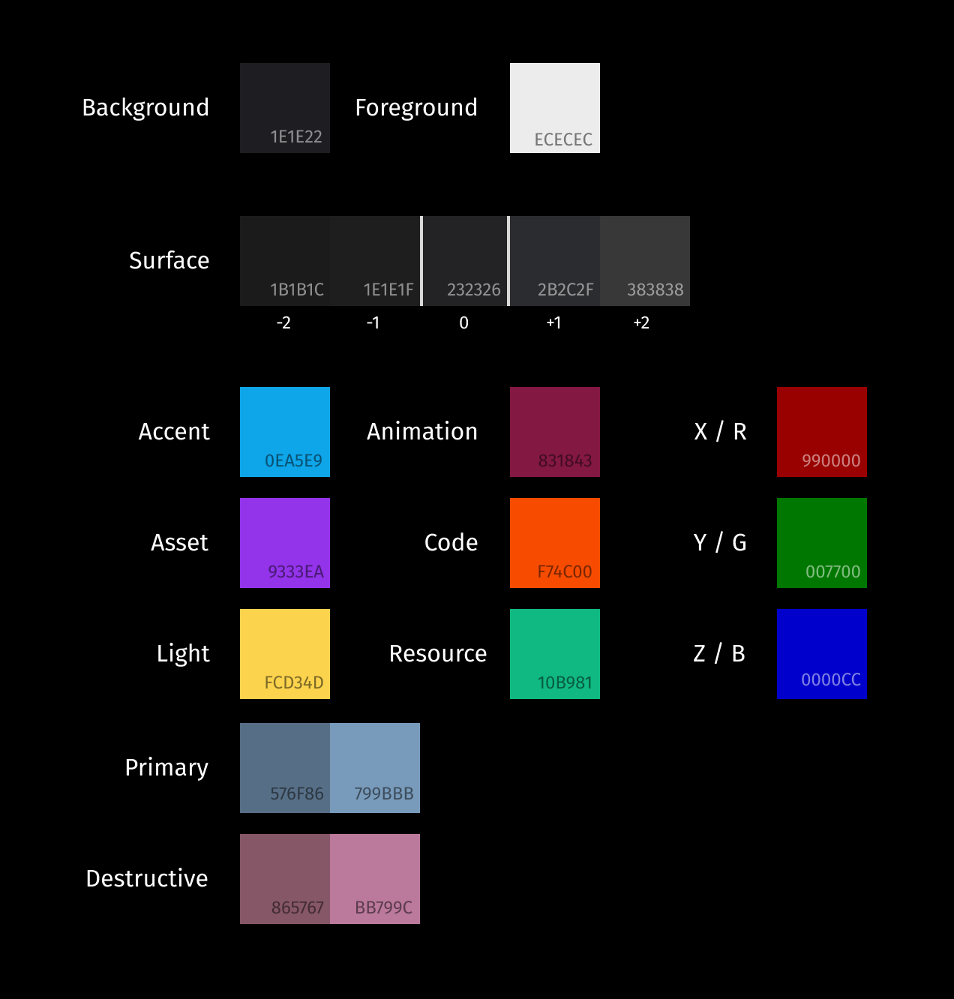
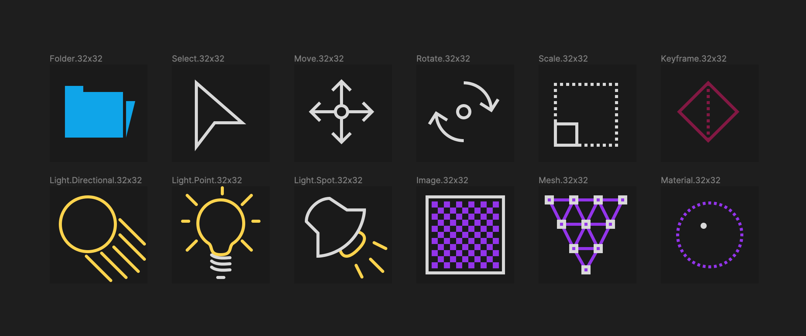
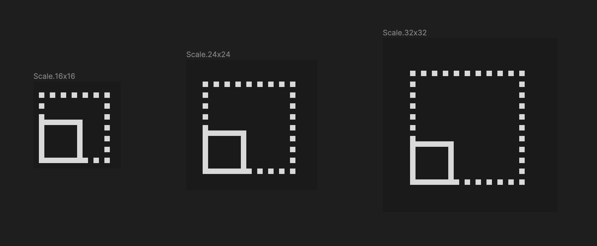
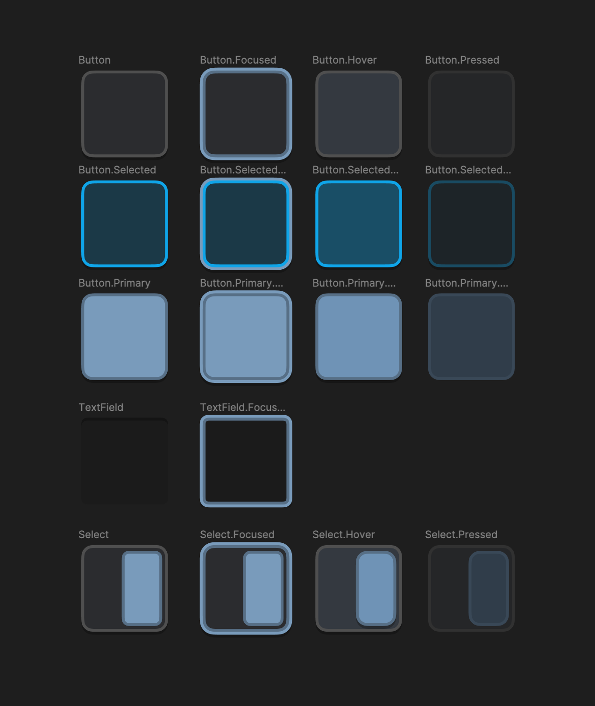

# Feature Name: `editor-design-system`

## Summary

This RFC proposes a design system for the Bevy editor, and lays out a high-level implementation plan for it.

It is divided in three main parts:

1. Theory;
2. Design;
3. Implementation.

### A Note on Terminology

Before getting started, it's crucial to acknowledge clashes between typical UI design/development lingo and Bevy's own ECS terminology:

This RFC pertains to the creation of a **Design System**, widely understood by the UI design/development community to refer to _“a collection of reusable components, guided by clear standards, that can be assembled together to build any number of applications.”_ ([Wikipedia](https://en.wikipedia.org/wiki/Design_system))

Very importantly, this is an **entirely unrelated concept from what we know as a “System” in the ECS sense**. What's proposed boils down to the introduction of:

1. A _new crate_ (`bevy_editor_ds`) responsible for providing standardized and reusable elements like typography, icons, color schemes, button styles, form inputs, and more;
2. A set of practices and conventions to ensure consistency in the editor design: a set of Human Interface Guidelines. (HIG)

The _design system_ crate will likely contain many _ECS systems_, along with components, resources and assets.

For reference, here's a table with some other relevant clashes in terminology one should keep an eye out for:

| UI Design/Development Term | Bevy ECS / UI Term      | Meaning
|:---------------------------|:------------------------|:--------------------------------------------------------
| _Component_                | _Widget_                | Self-contained, _reusable_ piece of UI, often with predefined interactive behaviors, such as a button or slider.
| _Layer_/_Element_/_View_   | _Entity_/_Node_         | Fundamental building block of the UI hierarchy.
| ...                        | ...                     | ...

## Part 1 — Theory

### Motivation

A high-quality editor tool is crucial for enabling broad industry adoption of a game engine, as it can streamline workflows that are laborious purely via code, and make the engine more approachable to developers and creatives from various backgrounds.

We would like to significantly enhance the appeal of Bevy and help foster an even more vibrant and inclusive community around the project by shipping a state-of-the-art editor tool. Beyond just raw features, user experience will be vital to the Bevy editor's success. (As an example, consider the momentum Blender gained after the 2.80 UI redesign, despite previous versions already being quite capable.)

A game engine editor is a sizeable piece of software with hundreds (or thousands!) of individual UI pieces. While we _could_ build such a UI in an _ad-hoc_ fashion, this would likely yield less-than-optimal results. We would therefore like to come up with a set of foundational principles, guidelines and reusable implementation pieces ahead-of-time to help ensure we stick the landing, efficiently delivering a polished, consistent and user-friendly editor from the get-go.

> **Note**
> There are still several technical challenges to be addressed in order to enable the underlying functionality of the editor, such as IPC, Data Model and Hot Reloading, to name a few. This RFC focuses solely on the UI/UX concerns, as we believe now is the right time to start exploring what the editor will look like and how it will behave. We expect the findings of this exploration will help inform new Bevy UI features and help us uncover any papercuts and limitations.

### Intended Audiences

#### This Document

This document is geared towards the people who will (eventually) build the Bevy Editor UI, and also towards those interested in making mockups and explorations of new editor features.

#### The Editor

The Bevy Editor is designed with three main audiences in mind:

- **3D Artists** — People who are already familiar with and proficient in existing 3D authoring tools, such as Blender, Maya, 3dsmax, Cinema 4D, or with 3D game engine editors, such as Godot, Unity or Unreal Engine.
- **2D Artists** — People who are already familiar with and proficient in existing 2D authoring tools, such as Krita, Photoshop, Illustrator, Figma, Affinity Designer, Aseprite, in specialized 2D game engine editors, such as GameMaker, Clickteam Fusion, and also in 3D game engine editors that are capable of 2D workflows, such as Godot, Unity or Unreal Engine.
- **1D Artists (Developers!)** — People who are already familiar with and are using Bevy as a game engine today, or are coming from other game engines and trying Bevy out for the first time, with or without prior experience using an Editor tool.

Additionally, whenever possible without compromising the usability and feature-richness for the three audiences above, and without requiring the creation of custom, separate major UI pieces, we'd also like to cater to a fourth audience:

- **Complete Beginners** — People who just got started with game development or design, are just curious to try a game engine for the first time, or have a game or hobby project idea but don't know how to get started.

### Foundational Principles

The following are the foundational principles the Bevy Editor design should abide to:

- **Professional** — The editor is a professional tool, and as such, is intended to be used (potentially) on a daily basis, for hours at time, to achieve specific goals. We should be mindful of the user's time, screen real estate, attention span, and patience. While the UI can (and should) be appealing, it shouldn't outshine the content the user is working on, and shouldn't interrupt or disrupt their workflow unless strictly necessary.
- **Readable** — The entire (relevant) UI state should be readable by the user, at a glance, at any time. This means that we shouldn't have (non-contextual) toggleable modal states that are invisible, hard to find and get into, and most importantly, _get out of_. However, it's perfectly acceptable (and desireable) to display things only contextually. Whenever possible, multiple redundant signs (text, color, position, visual hierarchy) should be used redundantly when communicating information to the user to ensure maximum readability.
- **Accessible** — We want the Bevy editor to be accessible to users with various abilities and needs. This includes designing the UI with attention to color contrast, font size, screen reader compatibility for users with vision impairments, and also suitable accomodations for motor, sensorial and cognitive differences. The UI should be fully internationalizable, not resource-intensive and compatible with the widest range of commodity hardware, to ensure users of all regions and economic circumstances can make the most of it.
- **Economical** — We acknowledge that Bevy is a project run by volunteers on their free time. We should therefore set up the design system in a way that using and extending it is not onerous. This means that, for example, we shouldn't expect editor developers to submit new features with highly detailed, animated 3D icons that take tens of hours and extensive design experience to author.
- **Familiar** — Whenever possible, the UI should feel familiar to the user. This means acknowledging the baggage of 30+ years of 2D, 3D graphics and developer tools, and leveraging established patterns, such as terminology, shortcuts, symbols, modifiers, layouts, information hierarchy and behaviors. There's of course a wide range of variability across different tools, so _some_ decisions will have to be made to establish a reasonable common denominator for the default settings. While we won't be using native UI frameworks to build the editor, we should honor native OS conventions, whenever possible.
- **Recognizable** — The Bevy editor should be instantly recognizeable as the Bevy editor, when seen in screenshots, and ideally even at a distance. For example, when watching a developer interview with a computer screen in the background, you should be able to point and say “Ha! That's Bevy!” This is of course, achieved tastefully by reusing subtle brand elements from the website, _not_ adding a giant watermark. The goal is to build a stronger sense of community, identity and trust with the users, and as a bonus also making us feel like we're leaving a mark! 😉

## Part 2 — Design

### Design Files and Collaboration

TBA

### High-Level UI Structure

TBA

#### Panels

TBA

#### Toolbar

TBA
#### Command Palette

TBA
#### Menu Bar

TBA

#### Status Bar

TBA

### Visual Style

#### Colors

Colors are a _very powerful signifier_. The human visual system is typically capable of segmenting, identifying and grouping visual elements based on color much more quickly than by shape, texture and other factors. This means that **color-coding** is a very good strategy for helping users read and navigate potentially crowded UIs.

Unfortunately, it also means that color can be _overpowering_ in terms of attention, distracting users from the content they're creating. Since human color perception is contextual, the presence of nearby colors can even distort the appearance of other colors, leading to a suboptimal, frustrating experience for workflows such as lighting and color-grading.

We work around this by being _very disciplined_ with color usage, and establishing the **90:9:1 rule** for colors. Most of the UI (90%) should be comprised of unsaturated grays, occasional primary/destructive controls use pastel shades (9%), and highly saturated colors are reserved for their specific consistent semantic meaning, and typically only applied in thin, 1px strokes. (1%)

Furthermore, we use the human tendency to perceive darker shades as being “receded” and lighter shades as being “protuding” from a surface to our favor, to help build a perceived depth-based visual hierarchy.

With all of that said, color alone should _never_ be used in an UI as the _sole_ signifier about the nature of an action, item, or state: Approximately 4.5% of the world population has some form of color-blindness, and even users with typical trichromatic color vision frequently choose to apply OS-level color filters—most commonly for color temperature matching and night-time blue light reduction—that might significantly affect color recognition.

Here's a breakdown of the color palette:

- **Background Color** — This is the color used to paint the portion of the UI that goes behind every single major UI element. It's primarily visible in the _gaps_ between UI landmarks such as panels, toolbars, views, acting as some sort of “grout” between the “tiles” of the UI. It should _not_ be used directly in controls, to preserve the sensation of depth.
- **Foreground Color** — This is the color used for text in controls and labels.
- **Surface Colors** — These are 5 gray shades, centered around a “base” color, ranging from -2 to +2. Positive shades are used for protuded controls (such as buttons), and negative shades are used for receded controls (such as text fields). The surface shades can be adjusted on a sliding scale (along with inverting the foreground color) to achieve Dark Mode / Light Mode UI, as well as many intermediate schemes suitable to color-sensitive workflows. The shades were extracted from the bevy website, with some tweaks.
- **Semantic Colors** — These are used sparingly to denote their specific meanings:
  - The accent color is used both to denote selection, as well as a general landmark color for things like folder icons. Light blue/cyan was chosen as it's a fairly generic color in UI design;
  - Magenta was chosen for Assets due to its association for “reusable components” in 2D Vector tools such as Figma; (Not to be confused with ECS components! See the “A Note on Terminology” section on the beginning of this document)
  - Yellow was chosen for Light due to the common representation of light bulbs and the sun as yellow;
  - Rose was chosen as an alternative to pure red (see below) due to the association with the “record” button;
  - Orange was chosen for Code, since we use Rust; 🦀
  - Emerald was chosen for Resources as a toss-up due to sheer elimination of available hues. If resources turn out to not be significant enough to warrant their own color, we might choose to re-assign it to something else.
- **Pure Red, Green and Blue** — These colors are used to denote _themselves_ (e.g. in material/shader inputs) as well as to denote the X, Y and Z 3D axes. The strong, well established association of these colors from other tools is leveraged to help users orient themselves in the 3D space. Importantly, their intensity values are tweaked independently so that they're all _perceptually_ at the same brightness level.
- **Primary and Destructive** — These pastel shades are intended for primary buttons in modal dialogs, and for destructive actions. (Such as deleting an item)

#### Typography

TBA

#### Iconography

Our icon style is heavily influenced by Blender's, but further simplified, with the primary goal being to make icon creation as economical as possible. Specifically, a single icon should _not_ take more than **10 minutes** to be created and fully fleshed out by someone comfortable with a vector tool.

Icons are:

- Vector-based;
- Authored in three separate sizes, (16x16, 24x24, 32x32) with small tweaks and simplifications made where appropriate to accomodate for the smaller sizes;
- Hinted to the pixel grid;
- Drawn with a 1px outline style, with a few exceptions (such as folders) meant to be clear visual landmarks;
- Either single color, or at most two colors, with one being the foreground color;
- Whenever “shading” is needed, dotted lines or some other dithering/meshing pattern should be used;

### Standard Widgets

#### Button

TBA

#### Checkbox

TBA

#### Radio Button

TBA

#### ScrollView

TBA

#### TextInput

TBA

#### ColorInput

TBA

#### NumericInput

TBA

#### SelectInput

TBA

#### Slider

TBA

####

## Part 3 — Implementation

### The `bevy_editor_ds` Crate

A new `bevy_editor_ds` crate is introduced, with the purpose of housing the reusable standard widgets built on top of `bevy_ui`, colors, typography styles, icons and other assets that make up the Bevy Editor Design System.

This crate is intended to be consumed both by a future `bevy_editor` crate, as well as by unofficial Bevy Editor plugins, so that they can both match the visual style of the editor and tightly integrate with it.

### Standard Widget Patterns

#### Bundle Structure

Standard widgets from `bevy_editor_ds` adhere to a standard bundle structure. For a standard widget named `MyWidget`:

| Component | Required? |  Role  | Access By Widget's Systems | Access By Widget's User  | Reactive?
|:----------|:----------|:-------|:---------------------------|:-------------------------|:-----------
| `my_widget: MyWidget` |  _Required_ | “Identifies” the Widget, and provides configurable properties for controlling its appearance and operation. (e.g. a button's label, or a slider's maximum value). The widget is expected to update its own internal hierarchy in response to a change in this component. | Read | Write | Yes
| `my_widget_state: MyWidgetState` | _Optional_ | Internal state data meant to be manipulated only by the widget's systems. Can only be initialized to `Default::default()` by the user of the widget. | Read, Write | — | No
| `my_widget_out: MyWidgetOut` | _Optional_ | Data the widget systems wants to expose to the user (e.g. a slider's current numeric value) | Write | Read | _Optional_
| `..NodeBundle` | _Required_ | All of the components provided by `NodeBundle`. | Read | Read, Write | Some

#### Delegate Trait Pattern

TBA

#### The `SlottedChildren<T>` Component

TBA

### Assets

### Icons

Icons are exported as bitmaps at 1x, 2x scale factors, and for the 32x32 variant, also exported at a constant 512x512 size, for “very large” display (e.g. on zoomed in icon grids) or as a texture in the editor world.

#### Directory Structure

#### Naming Convention

### 9-Slices

#### Directory Structure

#### Naming Convention
